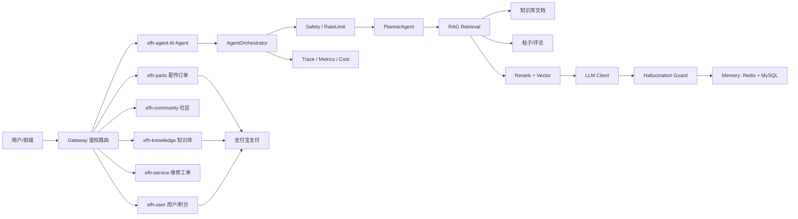

# AI Agent 开发工程师面试复习文档

> 面向岗位：Java 后端转 AI Agent 开发工程师  
> 项目背景：新能源叉车售后业务协同中台，包含社区、知识库、配件商城、维修工单、支付、物流、AI 助手。  
> 面试定位：你不是“只会调大模型接口”，而是“能把 LLM/RAG/Agent 能力工程化落到企业业务系统里的后端工程师”。

## 1. 面试时怎么介绍这个项目

### 1.1 一句话版本

这是一个面向车企售后场景的智能业务协同中台，我负责后端微服务和 AI Agent 能力建设。系统把社区帖子、知识库文档、配件采购、支付物流、维修工单和 AI 助手串成一条售后业务链路；AI 部分基于 RAG 检索知识库和社区内容，结合 OpenAI 兼容模型实现问答、引用溯源、多轮会话、工具调用、SSE 流式输出、限流、日志和成本监控。

### 1.2 2 分钟项目介绍

项目采用 Spring Cloud 微服务架构，核心模块包括：

- `efh-gateway`：统一网关、JWT 鉴权、路由、白名单、跨域。
- `efh-user`：用户、积分、地址、短信登录、积分购买支付宝支付。
- `efh-community`：帖子、评论、点赞、收藏、积分奖励。
- `efh-knowledge`：知识库文档上传、在线预览、权限控制、积分/支付宝解锁。
- `efh-parts`：备件商城、购物车、订单、支付宝支付、物流履约。
- `efh-service`：维修预约、工单。
- `efh-agent`：AI Agent 服务，提供 RAG 问答、多轮上下文、工具调用、流式输出、监控和成本统计。
- `efh-web`：Vue 3 前端，覆盖社区、知识库、配件、订单、AI 助手等页面。

AI Agent 的主流程是：

1. 网关鉴权后把用户身份传给 `efh-agent`。
2. `AgentOrchestrator` 生成 `traceId/sessionId`，做安全检查和限流。
3. 加载 Redis 短期记忆和 MySQL 长期摘要。
4. `PlannerAgent` 判断是否需要并行 RAG、工具增强等步骤。
5. `RagRetrievalService` 从知识库、帖子、评论中检索候选内容。
6. `RerankService` 结合关键词分数和向量相似度重排。
7. `LlmClient` 调用 OpenAI 兼容接口生成回答，支持同步和 SSE 流式。
8. `HallucinationGuardService` 做 grounding 检查，降低幻觉风险。
9. 将问答写入会话记忆，并记录 token、耗时、成本和执行链路。

### 1.3 面试官追问时的亮点表达

- 我不是单纯把用户问题转发给大模型，而是做了业务数据接入、权限过滤、检索增强、回答溯源、上下文记忆、限流降级、日志监控这些工程闭环。
- 知识库付费文档会根据用户解锁状态控制 RAG 内容，未解锁文档只允许摘要参与检索，避免 AI 泄露付费内容。
- 支付相关购买入口已经统一走支付宝跳转支付，支付成功后依赖异步回调改状态，避免前端直接伪造成功。
- Agent 有 fallback 机制：LLM 或 Embedding API 不可用时，会降级为检索摘要或本地哈希向量，不至于服务完全不可用。
- 当前版本是 Java 自研 Agent 编排，后续可以抽象成 MCP Server 或接入 LangGraph/Spring AI，提升工具标准化和可观测性。

## 2. 项目技术栈总览

### 2.1 后端技术栈

| 类别 | 技术 | 项目用途 | 面试要点 |
|---|---|---|---|
| 语言 | Java 8 | 微服务开发 | 集合、并发、JVM、异常、泛型 |
| 框架 | Spring Boot | 服务启动、配置、MVC | 自动配置、Bean 生命周期、配置绑定 |
| 微服务 | Spring Cloud Gateway | API 网关、鉴权、路由 | 过滤器链、路由转发、鉴权透传 |
| 服务注册 | Nacos | 注册发现/配置中心 | 注册发现原理、单机部署问题 |
| ORM | MyBatis-Plus | CRUD、分页、Mapper | SQL 优化、分页、事务 |
| 数据库 | MySQL 8 | 用户、订单、知识库、Agent 记忆 | 索引、事务、幂等、表设计 |
| 缓存 | Redis | 会话、验证码、限流、短期记忆 | key 设计、过期、分布式锁 |
| 分布式锁 | Redisson | Agent 会话写入互斥 | 锁超时、可重入、误用风险 |
| 消息 | Kafka | 社区事件扩展 | 消息可靠性、消费幂等 |
| 搜索 | Elasticsearch 预留 | 社区搜索扩展 | 倒排索引、分词、召回 |
| 支付 | 支付宝 SDK | 订单、知识库、积分支付 | 异步回调、验签、幂等 |
| 文档处理 | 文档文本抽取 | 知识库 RAG | PDF/Word/Excel 文本抽取、分块 |
| 部署 | Docker/Nginx/Linux | MySQL、Redis、Nacos、前端 | 端口、日志、进程、反向代理 |

### 2.2 前端技术栈

| 技术 | 项目用途 | 面试关联 |
|---|---|---|
| Vue 3 | 单页应用 | 前后端分离 |
| Vite | 构建 | 打包、环境变量 |
| Element Plus | UI 组件 | 后台/业务系统 UI |
| Pinia | 状态管理 | token、用户状态 |
| Axios | API 调用 | 鉴权 header、拦截器 |
| SSE/fetch | AI 流式响应 | text/event-stream |
| Nginx | 前端静态服务和 API 反代 | 部署、跨域 |

### 2.3 AI Agent 技术栈

| 能力 | 项目实现 | 要复习的知识 |
|---|---|---|
| LLM 接入 | `LlmClient` 调 OpenAI 兼容 `/chat/completions` | messages、system/user/assistant、temperature、timeout |
| RAG | `RagRetrievalService` 检索知识库/社区 | chunk、embedding、召回、重排、引用 |
| 向量检索 | `VectorStoreService` + `agent_vector_index` | embedding、cosine similarity、topK |
| 本地 fallback | n-gram 哈希向量 | 降级策略、可用性 |
| 多 Agent 编排 | `AgentOrchestrator` | planner、tool、memory、guard |
| 工具调用 | `AgentTool`、`ToolRegistry`、`ToolExecutor` | function calling、tool schema、鉴权 |
| 会话记忆 | Redis 短期 + MySQL 长期摘要 | short-term memory、long-term memory、压缩 |
| 上下文压缩 | `ContextCompressionService` | token 限制、摘要、最近消息保留 |
| 流式输出 | `SseEmitter` | SSE、断线、超时、前端消费 |
| 安全防护 | `PromptSafetyService`、`ContentSafetyService` | prompt injection、越权、输出过滤 |
| 幻觉控制 | `HallucinationGuardService` | grounded answer、低相关拒答、引用溯源 |
| 监控成本 | `AgentMetricsService`、`TokenUsage` | token 计费、QPS、耗时、成功率 |
| 链路日志 | `AgentExecutionLogService` | traceId、step log、排障 |

## 3. AI Agent 核心知识复习路线

### 3.1 LLM 基础

必须掌握：

- Transformer 基本概念：self-attention、token、context window。
- Chat 模型调用方式：system/user/assistant messages。
- temperature、top_p、max_tokens 的影响。
- prompt engineering：角色设定、约束、输出格式、few-shot。
- token 成本计算：prompt tokens、completion tokens、total tokens。
- 流式输出：SSE/WebSocket/HTTP chunk。
- 模型降级：超时、限流、失败 fallback。

面试能这样说：

> 我在项目里把 LLM 调用封装成 `LlmClient`，对外隐藏模型供应商差异，只依赖 OpenAI 兼容协议。同步问答走普通 HTTP，流式输出走 SSE。调用失败时不会直接报错，而是降级为检索摘要，保证业务可用性。

### 3.2 RAG

必须掌握：

- 为什么需要 RAG：解决私有知识、实时知识和可溯源问题。
- RAG 标准流程：采集 -> 清洗 -> 分块 -> embedding -> 向量索引 -> 检索 -> 重排 -> prompt 注入 -> 生成。
- chunk 怎么切：按标题、段落、token 长度、语义边界。
- embedding 是什么：把文本映射成向量，语义相近向量距离更近。
- 相似度算法：cosine similarity、dot product、L2。
- topK 和阈值：召回数量、相关性过滤。
- rerank：先粗召回，再精排，减少噪声。
- hybrid search：关键词 + 向量混合检索。
- 引用溯源：回答要带来源 ID、标题、片段、链接。
- 权限过滤：检索前过滤还是检索后过滤。

结合项目讲：

> 项目里 RAG 数据来自知识库文档、社区帖子和评论。知识库里有免费、积分、付费文档，所以检索时我会判断用户是否已解锁：已解锁文档可以读取全文，未解锁文档只使用标题和摘要，避免通过 AI 泄露付费内容。检索后用关键词分数和向量相似度重排，再把 top chunks 注入 prompt，并在响应里返回 sources。

### 3.3 Agent 和工具调用

必须掌握：

- Agent 和普通 ChatBot 的区别：Agent 能规划、调用工具、观察结果、继续推理。
- ReAct 思想：Reason + Act + Observe。
- Tool/function calling 流程：模型产生结构化工具调用，应用侧执行工具，再把结果交回模型。
- 工具 schema：name、description、parameters。
- 工具权限：登录、管理员、敏感工具黑名单。
- 工具幂等：查询工具安全，写操作要审批/权限/幂等。
- 工具调用失败处理：重试、降级、错误反馈。

结合项目讲：

> 我把工具抽象成 `AgentTool`，再通过 `ToolRegistry` 注册成 OpenAI tools 格式。执行时统一经过 `ToolExecutor`，里面做工具黑名单、登录校验、管理员校验和执行日志。当前工具主要是知识库搜索和社区搜索，后续可以扩展订单查询、维修工单查询，但写操作类工具必须额外做权限和确认。

### 3.4 多 Agent 编排

必须掌握：

- Planner：拆解问题，决定是否需要检索、工具、并行任务。
- Retriever/RAG Agent：负责资料召回。
- Tool Agent：调用外部工具。
- LLM Agent：生成回答。
- Guard Agent：安全、幻觉、合规检查。
- Memory Agent：维护上下文。
- Orchestrator：统一串联步骤、记录 trace。

项目中的编排链路：

```text
SafetyAgent
  -> PlannerAgent
  -> RagAgent / ToolAgent
  -> LlmAgent
  -> HallucinationGuard
  -> MemoryAgent
  -> Metrics / ExecutionLog
```

面试表达：

> 我的 Agent 不是完全让大模型自由决策，而是后端确定主链路，大模型主要负责理解和生成。这样可控性更强，适合企业业务系统。对于需要开放工具选择的场景，可以逐步把工具列表交给模型，但仍然保留后端鉴权、审计和风控。

### 3.5 记忆系统

必须掌握：

- short-term memory：当前会话消息历史。
- long-term memory：跨会话画像、摘要、偏好、历史事实。
- semantic memory：向量化知识记忆。
- procedural memory：用户习惯、任务流程。
- token 超限时的处理：滑动窗口、摘要压缩、重要性筛选。

项目对应：

- Redis：保存最近多轮消息，过期时间 24 小时。
- MySQL：保存会话摘要和消息数量。
- Redisson：同一用户同一会话写入时加锁，避免并发覆盖。
- `ContextCompressionService`：超过 token 阈值后压缩旧对话。

### 3.6 AI 安全

必须掌握：

- Prompt Injection：用户要求“忽略系统提示”“输出密钥”等。
- Data Leakage：RAG 泄露未授权知识库内容。
- Tool Abuse：让 Agent 调危险工具。
- Hallucination：模型编造维修建议、参数。
- 越权访问：A 用户查询 B 用户订单。
- 审计：工具调用、输入输出、成本、异常都要记录。

项目可讲：

- `PromptSafetyService` 拦截明显注入。
- 工具黑名单禁止危险工具。
- 知识库检索按用户权限过滤。
- `HallucinationGuardService` 对低 grounding 的回答追加风险提示。
- 支付入口依赖支付宝回调，避免前端伪造购买成功。

### 3.7 工程化和可观测性

必须掌握：

- 限流：单用户每分钟请求数，防止刷接口和模型费用失控。
- 超时：LLM 调用超时时间、SSE 超时时间。
- 重试：哪些请求能重试，哪些不能重试。
- 成本统计：按 token 估算费用。
- 日志：traceId、sessionId、step_order。
- 指标：QPS、平均耗时、成功率、失败率、token 消耗。
- 灰度和降级：关闭 LLM 后仍能返回检索摘要。

项目对应：

- `AgentRateLimitService`：Redis 限流。
- `AgentExecutionLogService`：每个步骤写入日志。
- `AgentMetricsService`：内存聚合 QPS、耗时、成本。
- `LlmClient`：失败 fallback。

## 4. 你需要重点复习的 Java 后端知识

### 4.1 Java 基础

- 集合：HashMap、ConcurrentHashMap、ArrayList、LinkedList。
- 并发：线程池、CompletableFuture、锁、volatile、synchronized。
- JVM：堆、栈、GC、OOM、CPU 飙高排查。
- 异常：业务异常和系统异常区分。
- IO：文件上传、文件读取、流关闭。

项目关联：

- Agent 并行 RAG 用 `CompletableFuture`。
- SSE 使用 `SseEmitter`。
- 文件知识库需要文本抽取和读取。
- 支付回调要保证幂等和事务。

### 4.2 Spring Boot / Spring Cloud

- Spring Bean 生命周期。
- `@ConfigurationProperties` 配置绑定。
- `@Transactional` 事务失效场景。
- Gateway Filter 鉴权流程。
- Feign 调用和超时。
- Nacos 注册发现和配置中心。
- Controller 参数校验和全局异常处理。

项目关联：

- 网关负责 JWT 鉴权并透传 `X-User-Id`。
- 支付宝回调接口必须加入网关白名单。
- Agent 配置通过 `efh.agent.*` 绑定。

### 4.3 MySQL

- 表设计：用户、订单、支付单、知识库、解锁记录、Agent 日志。
- 索引设计：user_id、order_no、pay_no、doc_id。
- 事务：支付回调更新支付单、订单、积分必须一致。
- 幂等：支付宝可能多次回调，同一个 payNo 只能入账一次。
- 锁：库存扣减、订单状态变更。

### 4.4 Redis

- 缓存和数据库一致性。
- 分布式锁使用注意事项。
- 限流：计数器、滑动窗口、令牌桶。
- session/context 存储。
- key 命名和过期策略。

### 4.5 支付和业务闭环

重点复习：

- 支付单和业务订单为什么要分开。
- 支付宝同步返回和异步通知区别。
- 为什么以后端异步回调为准。
- 验签流程。
- 回调幂等。
- 金额校验。
- 支付成功后再扣库存/加积分/解锁文档。

项目里的购买入口：

- 配件订单：下单 -> 生成支付单 -> 跳转支付宝 -> 回调成功 -> 订单待发货。
- 知识库付费解锁：生成知识库支付单 -> 跳转支付宝 -> 回调成功 -> 写解锁记录。
- 积分购买：生成积分支付单 -> 跳转支付宝 -> 回调成功 -> 增加积分。

## 5. AI Agent 岗位常问面试题和回答模板

### 5.1 什么是 AI Agent？和普通 ChatBot 有什么区别？

回答：

普通 ChatBot 主要是单轮或多轮文本生成，输入问题输出答案。AI Agent 更强调“目标驱动”和“行动能力”，它可以根据任务进行规划，调用外部工具或 API，观察工具结果，再继续推理和执行。工程上通常包含 Planner、Tool Executor、Memory、RAG、Guardrail、Observability 等模块。

结合项目：

> 在我的项目里，AI 助手不是只调模型，而是通过 `AgentOrchestrator` 串联安全检查、任务规划、RAG 检索、工具增强、LLM 生成、幻觉检查和会话记忆。

### 5.2 RAG 的完整流程是什么？

回答：

RAG 分为离线索引和在线问答两部分。离线侧把文档采集、清洗、切块、embedding 后写入向量库。在线侧对用户问题做 embedding，召回 topK 相关 chunk，再进行重排和权限过滤，把高质量上下文放进 prompt，让模型基于资料回答，并返回引用来源。

项目补充：

> 我这个项目目前结合关键词和向量重排，知识库文档根据解锁权限决定是否参与全文检索，最终在响应里返回 sources，方便用户查看原始文档或社区帖子。

### 5.3 chunk 怎么切才合理？

回答：

不能只按固定字符数切。更好的方式是按标题、段落、语义边界切，再控制 token 长度，保留文档标题、章节、来源 ID 等 metadata。过小会丢上下文，过大会影响召回精度和 token 成本。对技术手册类文档，可以按章节、故障码、维修步骤切分。

### 5.4 embedding 和 rerank 有什么区别？

回答：

Embedding 是把文本转成向量，用于快速语义召回；rerank 是对召回后的候选结果再排序，可以使用更复杂的模型或规则。典型方案是向量库先召回 top50，再用 reranker 选 top5。这样兼顾效率和准确性。

项目补充：

> 我项目里 `RerankService` 结合关键词权重和向量权重，先过滤低相似度内容，再保留 topK。

### 5.5 如何降低大模型幻觉？

回答：

第一，回答必须基于检索资料，prompt 中明确要求引用来源。第二，对召回结果设置相关性阈值，资料不足时拒答或提示不确定。第三，输出后做 grounding 检查，看回答和资料是否有足够重叠。第四，关键业务场景不要让模型直接执行写操作，要有人确认或后端规则校验。

项目补充：

> 项目里有 `HallucinationGuardService`，当资料相关性不足时会追加风险提示，尤其维修、安全、参数类回答不能让用户只凭 AI 操作设备。

### 5.6 Function Calling / Tool Calling 怎么实现？

回答：

应用先把可用工具以 schema 形式传给模型，模型根据用户问题返回工具名和 JSON 参数。应用侧执行工具，把工具结果再传回模型，模型基于工具结果生成最终回答。关键点是工具执行必须在后端完成，不能信任模型直接操作数据库；还要做鉴权、参数校验、幂等和审计。

项目补充：

> 我抽象了 `AgentTool` 接口，`ToolRegistry` 转成 OpenAI tools 格式，`ToolExecutor` 负责鉴权、黑名单和日志。

### 5.7 Agent 记忆怎么设计？

回答：

短期记忆保存当前会话最近消息，长期记忆保存跨会话摘要、偏好、关键事实。短期可以放 Redis 或数据库 checkpointer，长期可以放 MySQL/向量库。还要考虑 token 超限，通常保留最近 N 轮，再把旧对话压缩成 summary。

项目补充：

> 项目用 Redis 保存短期消息，用 MySQL 保存长期摘要；同一个 userId/sessionId 写入时用 Redisson 锁防止并发覆盖。

### 5.8 如何做 Agent 安全？

回答：

分四层：输入层防 prompt injection，检索层做数据权限过滤，工具层做鉴权和黑名单，输出层做敏感内容过滤和风险提示。所有工具调用必须记录 trace，写操作类工具要有幂等和审批机制。

### 5.9 AI Agent 如何做监控和成本控制？

回答：

监控维度包括请求量、成功率、平均耗时、P95/P99、token 消耗、模型费用、工具调用次数、失败原因。成本控制可以通过限流、缓存、模型分级、上下文压缩、减少 topK、复用 embedding、失败降级来做。

项目补充：

> 项目里记录 promptTokens、completionTokens 和 costYuan，并提供 metrics 接口。还用 Redis 做单用户限流。

### 5.10 Java 项目为什么不用 LangChain，自己写 Agent 编排？

回答：

这个项目更偏业务系统落地，核心诉求是可控、易调试、和现有 Java 微服务体系集成。自研编排能更清楚地控制鉴权、权限过滤、支付业务、日志、事务和降级。后续如果 Agent 流程复杂，可以引入 LangGraph/Spring AI，或者把工具能力标准化成 MCP Server。

### 5.11 MCP 是什么？为什么现在重要？

回答：

MCP 是 Model Context Protocol，用来标准化模型应用和外部工具/数据源之间的连接。它把外部能力抽象成 Resources、Prompts、Tools，减少每个模型、每个工具都单独适配的问题。对企业 Agent 来说，MCP 适合把订单查询、知识库查询、工单系统、CRM 等能力统一暴露给不同 AI 客户端。

项目结合：

> 我项目里的 `KnowledgeSearchTool`、`CommunitySearchTool` 可以进一步包装成 MCP tools。这样不只是当前 Java Agent 能调用，未来 IDE、客服助手、移动端 Agent 都可以通过 MCP 复用这些能力。

### 5.12 支付场景为什么不能让前端直接确认购买成功？

回答：

前端不可信，用户可以篡改请求。如果购买后直接加积分或改订单状态，就可能被伪造。正确做法是后端生成支付单，用户跳转支付宝，支付宝异步回调后端，后端验签、校验金额、校验订单状态，再幂等更新业务状态。

项目补充：

> 我已经把配件、知识库、积分购买都改成跳转支付宝支付，删除了配件模拟支付入口，积分也从直接到账改成回调后到账。

## 6. 项目可以写进简历的描述

### 6.1 简历项目描述

新能源叉车售后智能协同中台  
项目描述：面向车企售后业务，建设集社区问答、知识库、配件采购、维修工单、支付物流和 AI 助手于一体的微服务平台。AI 助手基于知识库文档和社区内容实现 RAG 问答，支持多轮会话、工具调用、流式输出、引用溯源、权限过滤、限流、链路日志和 token 成本统计。

### 6.2 个人职责

- 负责 Spring Cloud 微服务架构设计，拆分用户、社区、知识库、配件、工单、Agent 等服务。
- 设计并实现 AI Agent 编排链路，包括 Safety、Planner、RAG、Tool、LLM、Guard、Memory。
- 实现知识库/社区混合检索，结合关键词和向量相似度重排，返回可溯源引用。
- 设计 Redis 短期记忆 + MySQL 长期摘要的多轮上下文机制，并通过 Redisson 保证并发一致性。
- 封装 OpenAI 兼容 LLM 客户端，支持同步问答、SSE 流式输出、token 成本统计和失败降级。
- 抽象 Agent 工具体系，支持工具注册、schema 暴露、鉴权、黑名单和调用日志。
- 完成支付宝支付闭环，支持配件订单、知识库解锁、积分购买，基于异步回调和幂等状态更新保障交易可靠性。
- 负责 Docker/Nginx/Linux 部署、服务排障和接口联调。

### 6.3 简历技术关键词

Java 8、Spring Boot、Spring Cloud Gateway、Nacos、MyBatis-Plus、MySQL、Redis、Redisson、Kafka、Docker、Nginx、Vue 3、支付宝支付、OpenAI Compatible API、RAG、Embedding、Vector Search、Function Calling、Tool Calling、SSE、Prompt Engineering、Agent Memory、Prompt Injection Defense、Observability。

## 7. 项目面试时的架构图



## 8. 面试前 7 天复习计划

### Day 1：项目整体和微服务

- 能画出项目模块图。
- 讲清楚一次请求如何经过网关到服务。
- 复习 JWT、Gateway Filter、Nacos、Nginx。

### Day 2：RAG

- 背熟 RAG 全流程。
- 复习 chunk、embedding、topK、rerank、hybrid search。
- 准备“知识库权限过滤”这个亮点。

### Day 3：Agent

- 复习 ReAct、Planner、Tool Calling、Memory。
- 结合 `AgentOrchestrator` 讲完整链路。
- 准备“为什么自研编排而不是直接 LangChain”。

### Day 4：LLM 工程化

- 复习 OpenAI 兼容接口、messages、SSE、token 成本。
- 复习 timeout、fallback、限流、监控。
- 准备“模型挂了怎么办”的回答。

### Day 5：安全

- 复习 prompt injection、越权、数据泄露、工具滥用。
- 讲清楚知识库付费内容如何防止 AI 泄露。
- 讲清楚支付为什么以后端回调为准。

### Day 6：数据库和支付

- 复习订单表、支付表、积分表、解锁表。
- 复习事务、幂等、索引、金额校验。
- 准备支付宝回调问题。

### Day 7：模拟面试

- 2 分钟项目介绍。
- 5 分钟 AI Agent 深挖。
- 5 分钟支付和业务闭环。
- 5 分钟线上部署排障。

## 9. 你必须能手写/口述的流程

### 9.1 RAG 问答流程伪代码

```java
public ChatResponse chat(Long userId, String question, String sessionId) {
    validatePrompt(question);
    rateLimit(userId);

    ConversationContext ctx = memory.load(userId, sessionId);
    ctx = compression.compressIfNeeded(ctx);

    List<String> plan = planner.plan(question);
    List<RagChunk> chunks = retriever.retrieve(question, userId, plan);
    chunks = reranker.rerank(question, chunks);

    String answer = llm.generate(question, chunks, ctx.getHistory());
    answer = guard.checkGrounding(answer, chunks);

    memory.append(userId, sessionId, question, answer);
    metrics.record(tokens, duration);

    return new ChatResponse(answer, chunks);
}
```

### 9.2 支付回调流程伪代码

```java
@Transactional
public String handleNotify(Map<String, String> params) {
    if (!alipay.verify(params)) {
        return "failure";
    }

    String payNo = params.get("out_trade_no");
    Payment payment = paymentMapper.selectByPayNo(payNo);
    if (payment == null) {
        return "failure";
    }

    if (payment.isSuccess()) {
        return "success";
    }

    if (!amountEquals(payment.getAmount(), params.get("total_amount"))) {
        return "failure";
    }

    payment.markSuccess(params.get("trade_no"));
    businessService.onPaid(payment);
    return "success";
}
```

## 10. 这个项目目前可以继续增强的方向

面试官问“还有什么不足”时，可以主动说：

- 当前向量库用 MySQL JSON 和本地 fallback，生产可以换成 Milvus、pgvector、Elasticsearch dense vector 或 OpenSearch。
- 当前 RAG 分块还可以更精细，按维修手册章节、故障码、车型、部件进行结构化切分。
- 当前 rerank 是规则 + 向量分数，后续可以接入 bge-reranker 或模型 rerank。
- 当前工具是 Java 内部工具注册，后续可以封装为 MCP Server，实现跨客户端复用。
- 当前监控是内存聚合，后续可以接 Prometheus + Grafana。
- 当前 Agent 是后端固定编排，复杂任务可以引入 LangGraph 类状态机思想，实现可恢复、可审计的图编排。
- 对维修安全类回答可以增加“高风险动作拒答”和“人工专家确认”。

## 11. 推荐复习资料

- OpenAI Function Calling / Tool Calling：理解工具调用的标准流程，即模型返回工具调用，应用执行工具后再把结果交回模型。  
  https://developers.openai.com/api/docs/guides/function-calling
- OpenAI Tools：了解内置工具、远程 MCP、函数工具等能力边界。  
  https://developers.openai.com/api/docs/guides/tools
- LangChain / LangGraph Memory：复习短期记忆、线程状态、持久化 checkpointer 的思路。  
  https://docs.langchain.com/oss/python/concepts/memory
- MCP 官方规范：重点看 Tools、Resources、Prompts 三个概念。  
  https://modelcontextprotocol.io/specification/2025-06-18
- MCP Tools 规范：理解工具名称、schema、调用和外部系统交互。  
  https://modelcontextprotocol.io/specification/2025-06-18/server/tools

## 12. 最后给你的面试策略

你的优势不是“比算法同学更懂模型原理”，而是：

- 你有后端工程基础，能把 AI 能力接进真实业务系统。
- 你能讲清楚权限、支付、日志、事务、部署、排障，这些是企业 AI 落地最缺的能力。
- 你有车企业务背景，能把 AI Agent 落到售后、维修、知识库、配件采购这些具体场景。
- 你需要补强的是 AI Agent 概念体系、RAG 原理、工具调用标准、MCP/LangGraph 生态。

面试时建议主线：

> 我原来是后端开发，熟悉 Java 微服务、数据库、支付和业务系统落地。这个项目里我把 AI Agent 能力接到了车企售后场景中，用 RAG 检索知识库和社区内容，用 Agent 编排做安全、规划、工具、记忆和监控。我更关注的是企业级 AI Agent 的工程化：权限、可靠性、可观测性、成本和业务闭环。
