# AI Agent 开发工程师融会贯通复习手册

> 目标：把 AI Agent 岗位要求、核心知识、项目实现和面试表达串成一张完整地图。  
> 适合你当前定位：Java 后端 -> AI Agent 应用开发工程师 / 大模型应用开发工程师。

## 1. 你要先建立一个总认知

AI Agent 开发工程师不是单纯“会调大模型接口”，而是要能把大模型能力接进真实业务系统。

你需要把它理解成 8 个模块：

```text
AI Agent = LLM 调用
         + RAG 知识检索
         + Tool Calling 工具调用
         + Workflow / Planner 任务编排
         + Memory 多轮记忆
         + Safety 安全防护
         + Observability 可观测性
         + Business Integration 业务系统集成
```

你这个项目刚好能覆盖这 8 个模块：

| AI Agent 能力 | 岗位要求 | 你项目里的对应模块 |
|---|---|---|
| LLM 调用 | 接入大模型 API，理解 prompt、token、stream | `efh-agent/LlmClient` |
| RAG | 知识库问答、向量检索、引用溯源 | `RagRetrievalService`、知识库、社区 |
| Tool Calling | 让模型调用业务工具/API | `AgentTool`、`ToolRegistry`、`ToolExecutor` |
| Workflow | 多步骤任务、Agent 编排 | `AgentOrchestrator` |
| Memory | 多轮会话、长期记忆 | `ConversationContextStore`、Redis、MySQL |
| Safety | 注入攻击、防泄露、幻觉控制 | `PromptSafetyService`、`HallucinationGuardService` |
| Observability | 日志、trace、成本、指标 | `AgentExecutionLogService`、`AgentMetricsService` |
| Business | 企业业务落地 | 用户、知识库、配件、支付、物流、维修 |

## 2. 单向向右思维导图

> 如果你用 Mermaid / Draw.io / mindmap 工具，可以直接复制下面代码。  
> 我用 `flowchart LR`，因为 Mermaid 原生 `mindmap` 不好控制单向向右，`flowchart LR` 更适合你之前想要的“单向向右”。

```mermaid
flowchart LR
    A["AI Agent开发工程师"] --> B["岗位核心目标"]
    B --> B1["把LLM接入真实业务系统"]
    B --> B2["让Agent能检索/规划/调用工具/记忆"]
    B --> B3["保证权限/安全/成本/可观测"]

    A --> C["LLM基础"]
    C --> C1["Chat Completions"]
    C --> C2["Messages: system/user/assistant"]
    C --> C3["Prompt Engineering"]
    C --> C4["Token与成本"]
    C --> C5["SSE流式输出"]
    C --> C6["模型超时与降级"]
    C6 --> CP["项目: LlmClient"]

    A --> D["RAG知识库"]
    D --> D1["文档采集与清洗"]
    D --> D2["Chunk分块"]
    D --> D3["Embedding向量化"]
    D --> D4["Vector Search向量召回"]
    D --> D5["Keyword Search关键词召回"]
    D --> D6["Rerank重排"]
    D --> D7["引用溯源Sources"]
    D --> D8["权限过滤"]
    D8 --> DP["项目: 知识库未解锁只检索摘要"]
    D7 --> DR["项目: 返回source/link/snippet"]

    A --> E["Agent工作流"]
    E --> E1["Planner任务规划"]
    E --> E2["RAG Agent检索"]
    E --> E3["Tool Agent调用工具"]
    E --> E4["LLM Agent生成答案"]
    E --> E5["Guard Agent安全检查"]
    E --> E6["Memory Agent写入记忆"]
    E6 --> EP["项目: AgentOrchestrator"]

    A --> F["Tool Calling"]
    F --> F1["工具Schema"]
    F --> F2["Function Calling"]
    F --> F3["工具鉴权"]
    F --> F4["工具黑名单"]
    F --> F5["工具调用日志"]
    F --> FP["项目: AgentTool/ToolRegistry/ToolExecutor"]

    A --> G["Memory记忆"]
    G --> G1["短期记忆"]
    G --> G2["长期摘要"]
    G --> G3["上下文压缩"]
    G --> G4["Session隔离"]
    G --> G5["并发写入锁"]
    G --> GP["项目: Redis + MySQL + Redisson"]

    A --> H["安全与幻觉治理"]
    H --> H1["Prompt Injection"]
    H --> H2["数据权限防泄露"]
    H --> H3["工具越权防护"]
    H --> H4["Grounding检查"]
    H --> H5["低相关拒答/风险提示"]
    H --> HP["项目: PromptSafety + HallucinationGuard"]

    A --> I["工程化"]
    I --> I1["限流"]
    I --> I2["超时"]
    I --> I3["失败降级"]
    I --> I4["TraceId链路日志"]
    I --> I5["Token成本统计"]
    I --> I6["Metrics监控"]
    I --> IP["项目: RateLimit + ExecutionLog + Metrics"]

    A --> J["业务落地"]
    J --> J1["车企售后"]
    J --> J2["知识库问答"]
    J --> J3["配件采购"]
    J --> J4["维修工单"]
    J --> J5["支付宝支付"]
    J --> J6["物流履约"]
    J --> JP["项目: ev-forklift-hub完整业务闭环"]

    A --> K["进阶补强"]
    K --> K1["MCP"]
    K --> K2["LangGraph/Spring AI"]
    K --> K3["Milvus/pgvector"]
    K --> K4["Agent Eval评测"]
    K --> K5["Prometheus/Grafana"]
```



## 3. 你应该按什么顺序复习

不要从模型原理开始硬啃。你的目标是 AI Agent 应用开发，顺序应该是：

```text
业务系统
  -> LLM API
  -> Prompt
  -> RAG
  -> Tool Calling
  -> Agent Workflow
  -> Memory
  -> Safety
  -> Observability
  -> MCP / LangGraph / Spring AI
```

### 第一层：能把项目讲明白

你必须先能讲清楚：

- 这个项目解决什么问题？
- 为什么车企售后需要 AI Agent？
- 为什么不是普通客服机器人？
- AI 助手接入了哪些业务数据？
- 用户问问题后，后端链路怎么走？
- 答案为什么可信？
- 付费知识库怎么防止泄露？

面试表达：

> 这个项目面向车企售后，售后知识分散在维修手册、社区帖子、评论和工单经验里。AI Agent 的价值不是闲聊，而是帮助用户从企业知识库和社区经验中快速找到可溯源的维修建议、配件信息和操作说明。

### 第二层：能把 RAG 讲透

你必须掌握：

1. RAG 为什么存在  
   大模型自身不知道企业私有知识，也不保证最新和准确，所以要先检索企业知识，再让模型基于资料回答。

2. RAG 标准流程  
   文档上传 -> 文本抽取 -> 分块 -> embedding -> 向量索引 -> 用户问题 embedding -> 召回 topK -> 重排 -> prompt 注入 -> LLM 生成 -> 返回来源。

3. 你项目里的 RAG  
   - 知识库文档。
   - 社区帖子。
   - 评论。
   - 权限过滤。
   - 关键词 + 向量重排。
   - source 引用。

面试表达：

> 我项目里的 RAG 不是简单全文搜索，而是结合知识库、帖子和评论多源召回。知识库还要考虑权限，未解锁付费文档不能把全文给模型，只能给标题和摘要，避免通过 AI 绕过付费权限。

### 第三层：能把 Tool Calling 讲透

你必须掌握：

- 工具是什么？
- Function Calling 和 Tool Calling 的区别和联系。
- 工具 schema 包含什么？
- 为什么工具要后端执行？
- 为什么工具要鉴权？
- 哪些工具可以开放给 Agent？
- 哪些工具不能直接开放？

你项目里的工具体系：

```text
AgentTool
  -> KnowledgeSearchTool
  -> CommunitySearchTool

ToolRegistry
  -> 注册工具
  -> 转 OpenAI tools schema

ToolExecutor
  -> 工具黑名单
  -> 登录校验
  -> 管理员校验
  -> 调用日志
```

面试表达：

> 工具调用不能让模型直接操作数据库，而是模型提出“想调用哪个工具和参数”，后端校验后执行。这样能保证权限、审计和安全。

### 第四层：能把 Agent Workflow 讲透

你的项目主链路：

```text
用户问题
  -> Safety 检查
  -> RateLimit 限流
  -> Load Memory 加载上下文
  -> Planner 判断任务策略
  -> RAG 检索知识
  -> Tool 增强
  -> LLM 生成回答
  -> Guard 幻觉检查
  -> Save Memory 写入记忆
  -> Metrics / Logs 记录指标
```

面试表达：

> 我没有让大模型完全自由控制流程，而是采用后端可控编排。这样在企业场景中更安全，尤其涉及知识库权限、支付、订单和维修建议时，不能完全依赖模型自主决策。

### 第五层：能把 Memory 讲透

你要理解三种记忆：

| 记忆类型 | 作用 | 项目实现 |
|---|---|---|
| 短期记忆 | 当前会话最近消息 | Redis |
| 长期记忆 | 历史摘要、会话摘要 | MySQL |
| 语义记忆 | 可被检索的知识 | 知识库/向量索引 |

项目里的关键点：

- sessionId 区分会话。
- Redis 保存最近消息。
- MySQL 保存长期摘要。
- 超过 token 阈值做压缩。
- Redisson 锁防止并发写乱。

面试表达：

> 多轮对话不能无限塞进 prompt，我用短期窗口 + 长期摘要的方式控制上下文长度。旧对话压缩成摘要，最近几轮原文保留，这样既节省 token，又能保持连续性。

### 第六层：能把安全讲透

AI Agent 的安全分 5 类：

1. Prompt Injection  
   用户要求忽略系统提示、输出密钥、绕过限制。

2. 数据泄露  
   未授权用户通过 AI 拿到付费文档全文。

3. 工具滥用  
   模型调用危险工具、越权工具、写操作工具。

4. 幻觉  
   模型编造维修参数、故障原因、操作步骤。

5. 业务风险  
   支付、订单、库存、积分不能让 AI 或前端随便改。

项目对应：

- `PromptSafetyService`：注入检测。
- `ToolExecutor`：工具鉴权和黑名单。
- `RagRetrievalService`：知识库权限过滤。
- `HallucinationGuardService`：低相关资料风险提示。
- 支付回调：所有购买以后端支付宝回调为准。

### 第七层：能把工程化讲透

AI Agent 面试越来越重视工程化：

| 工程问题 | 你要会回答 | 项目对应 |
|---|---|---|
| 模型慢怎么办 | SSE、异步、超时、降级 | `SseEmitter`、fallback |
| 模型贵怎么办 | 限流、topK 控制、上下文压缩 | `AgentRateLimitService`、token 统计 |
| 怎么排查问题 | traceId、step log | `AgentExecutionLogService` |
| 怎么看效果 | metrics、评测集 | `AgentMetricsService`，后续补 Agent Eval |
| 怎么防并发问题 | session lock | Redisson |
| 怎么保证服务可用 | fallback、降级、日志 | LLM 失败返回检索摘要 |

## 4. 结合项目的完整面试串讲

你可以背这一版：

> 我这个项目是一个新能源叉车售后智能协同中台，业务上覆盖社区、知识库、配件采购、维修工单、支付和物流。AI Agent 部分主要解决售后知识分散的问题，比如维修手册在知识库，故障经验在社区帖子，用户希望直接问“某个电池故障怎么排查”，系统能检索相关资料并生成有引用的回答。
>
> 技术上，用户请求先经过 Gateway 鉴权，传到 `efh-agent`。Agent 服务里有一个 `AgentOrchestrator`，它会先做 prompt 安全检查和限流，然后加载 Redis 和 MySQL 中的会话记忆，再由 Planner 判断是否需要并行检索知识库和社区。RAG 检索后会做关键词和向量重排，并且根据用户权限过滤付费知识库内容。之后 LLM 生成回答，Guard 模块检查回答和资料的相关性，最后保存对话记忆，并记录 trace、token 和成本。
>
> 我做这个项目时比较关注企业落地，不只是调模型。比如知识库有付费内容，未解锁不能把全文给模型；工具调用必须走后端鉴权和日志；模型失败要降级；支付购买必须以支付宝异步回调为准，不能前端直接改状态。这些是我作为后端转 AI Agent 工程师的优势。

## 5. 高频面试题，你要能马上回答

### Q1：AI Agent 和普通大模型问答有什么区别？

普通问答是输入问题、输出文本。Agent 会围绕目标进行规划，调用工具，读取外部知识，维护记忆，观察结果，再生成最终答案。工程上通常包含 Planner、Tool、Memory、RAG、Guard 和 Trace。

### Q2：你项目里的 Agent 怎么规划任务？

当前通过 `PlannerAgent` 根据问题判断是否需要并行 RAG、工具增强等策略。主流程仍由后端 `AgentOrchestrator` 控制，这样在企业场景里更可控，避免模型自由调用危险能力。

### Q3：RAG 如何保证答案准确？

通过多源召回、重排、相关性阈值、引用溯源和 grounding 检查。资料不足时不让模型自由发挥，而是提示用户资料不足或建议人工核实。

### Q4：知识库权限怎么和 RAG 结合？

检索前判断用户权限。免费文档和已解锁文档可以全文参与检索；未解锁付费文档只允许标题和摘要参与检索，不能把全文放入 prompt。

### Q5：Function Calling 怎么落地？

后端定义工具 schema，模型选择工具和参数，后端校验权限后执行工具，再把结果返回给模型或直接用于回答。工具执行必须有鉴权、参数校验、黑名单、日志和超时。

### Q6：多轮记忆怎么避免 token 爆炸？

保留最近几轮原文作为短期记忆，把较早的对话压缩成摘要作为长期记忆。每次构造 prompt 时只放摘要和最近消息。

### Q7：怎么防 prompt injection？

输入层检测典型注入语句，系统 prompt 明确工具和权限边界，工具执行层不信任模型输出，所有敏感操作必须后端鉴权，输出层做敏感内容过滤。

### Q8：模型调用失败怎么办？

设置超时，捕获异常，降级为检索摘要或提示稍后重试。重要业务流程不能依赖模型成功才能继续，比如支付、订单状态仍由后端业务系统负责。

### Q9：为什么你项目里支付能体现工程能力？

因为所有购买入口都走支付宝跳转支付，并以后端异步回调为准。后端验签、校验状态、幂等更新，再执行加积分、解锁文档、订单待发货等业务动作，避免前端伪造成功。

### Q10：项目还可以怎么增强？

可以接入 pgvector/Milvus 做生产级向量检索；把业务工具封装成 MCP Server；增加 Agent Eval 评测集；接入 Prometheus/Grafana；用 Spring AI 或 LangGraph 思想重构复杂工作流。

## 6. 你需要掌握的关键词清单

### 必须熟练

- LLM
- Prompt Engineering
- System Prompt
- Chat Completions
- Token
- Temperature
- SSE Streaming
- RAG
- Chunk
- Embedding
- Vector Search
- Cosine Similarity
- TopK
- Rerank
- Hybrid Search
- Sources / Citation
- Agent
- Planner
- ReAct
- Tool Calling
- Function Calling
- Memory
- Context Compression
- Prompt Injection
- Hallucination
- Grounding
- Guardrails
- Trace
- Metrics
- Token Cost

### 能讲清楚即可

- MCP
- LangChain
- LangGraph
- LlamaIndex
- Spring AI
- Milvus
- pgvector
- Prometheus
- Grafana
- Agent Eval
- LoRA
- vLLM

## 7. 14 天复习计划

### 第 1-2 天：项目总览

- 画出项目模块图。
- 背熟 2 分钟项目介绍。
- 熟悉 `efh-agent`、`efh-knowledge`、`efh-community`、`efh-parts`。

### 第 3-4 天：LLM + Prompt

- 复习 messages、system prompt、temperature、token。
- 看 `LlmClient`。
- 能讲同步调用和 SSE 流式输出。

### 第 5-6 天：RAG

- 复习 RAG 全流程。
- 看 `RagRetrievalService`、`RerankService`、`VectorStoreService`。
- 准备“权限型 RAG”讲法。

### 第 7-8 天：Agent + Tool

- 看 `AgentOrchestrator`。
- 看 `AgentTool`、`ToolRegistry`、`ToolExecutor`。
- 能讲 Planner、Tool Calling、后端鉴权。

### 第 9 天：Memory

- 看 `ConversationContextStore`、`ContextCompressionService`。
- 讲清 Redis 短期、MySQL 长期、Redisson 锁。

### 第 10 天：Safety

- 看 `PromptSafetyService`、`HallucinationGuardService`。
- 准备 prompt injection、数据泄露、幻觉治理回答。

### 第 11 天：工程化

- 复习限流、trace、metrics、成本统计、fallback。
- 看 `AgentRateLimitService`、`AgentExecutionLogService`、`AgentMetricsService`。

### 第 12 天：业务闭环

- 复习支付、知识库解锁、积分购买、配件订单。
- 讲清“为什么以后端回调为准”。

### 第 13 天：岗位生态

- 复习 MCP、LangGraph、Spring AI、Milvus/pgvector。
- 准备“当前项目不足和后续优化”。

### 第 14 天：模拟面试

- 2 分钟项目介绍。
- 讲 RAG。
- 讲 Agent。
- 讲 Tool Calling。
- 讲 Memory。
- 讲安全和支付。
- 讲不足和优化。

## 8. 最重要的 5 个面试卖点

你要反复强化这 5 个点：

1. **我有后端工程底子**  
   不只是 AI demo，能做微服务、数据库、Redis、支付、部署。

2. **我做的是企业级 RAG**  
   有知识库、社区、多源检索、权限过滤、引用溯源。

3. **我理解 Agent 工程化**  
   有 Planner、Tool、Memory、Guard、Trace、Metrics。

4. **我关注安全和业务可控**  
   付费内容不泄露，工具要鉴权，支付以后端回调为准。

5. **我知道下一步怎么进阶**  
   MCP、Agent Eval、生产向量库、Prometheus、Spring AI / LangGraph。

## 9. 你最终要形成的一句话

> 我不是只会调大模型接口，而是能把 LLM、RAG、Tool Calling、Memory 和安全观测接入真实 Java 微服务业务系统，做出可上线、可排障、可控成本、可管权限的企业级 AI Agent。
